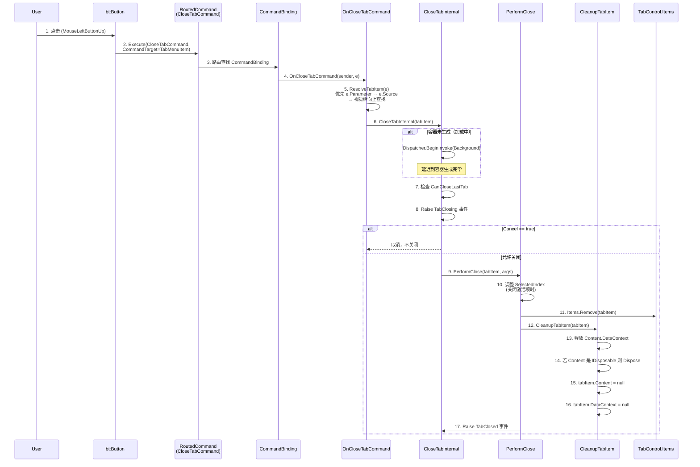

# TabMenu 关闭按钮功能实现说明

> 适用范围：`Junevy.Controls.Controls.Menu.TabMenu` 自定义控件
> 涉及文件：[TabMenu.xaml](file:///c:/Users/AbbyZhou/Documents/WorkSpace/Junevy.Controls/Controls/Menu/TabMenu.xaml)、[TabMenu.xaml.cs](file:///c:/Users/AbbyZhou/Documents/WorkSpace/Junevy.Controls/Controls/Menu/TabMenu.xaml.cs)
> 目标：让 TabItem 标题栏的关闭按钮能够正确移除对应的 Tab，并彻底释放资源

---

## 1. 问题分析

### 1.1 原始缺陷

在 `TabMenu.xaml#L96-105` 中，关闭按钮仅声明了外观相关属性：

```xml
<bt:Button
    Grid.Column="2"
    Height="{TemplateBinding Height}"
    Margin="5,0,5,0"
    HorizontalAlignment="Right"
    Content="&#xe639;"
    FontFamily="..."
    Foreground="{TemplateBinding Foreground}"
    Template="{StaticResource NoBorderButtonTemplate}"
    Visibility="..." />
```

**缺少 `Click` 事件处理或 `Command` 绑定**，导致点击关闭按钮后没有任何响应。同时 `TabMenu` 自定义控件本身也没有任何关闭 Tab 的命令/方法/事件基础设施。

### 1.2 修复目标

| 编号 | 要求 |
|---|---|
| ① | 点击按钮时正确定位并移除对应的 `TabMenuItem` |
| ② | 彻底释放 TabItem 关联的 `DataContext`、内容、事件订阅，防止内存泄漏 |
| ③ | 严格遵循 WPF 自定义控件开发规范（RoutedCommand + CommandBinding 模式） |
| ④ | 在各种边界情况（最后一个 Tab、加载中、异常）下保持稳定 |
| ⑤ | 关闭功能在激活 / 未激活 / 加载中三种状态下都正确 |
| ⑥ | 与现有 XAML 结构和后台逻辑保持完全兼容 |

---

## 2. 设计方案

### 2.1 为什么选择 `RoutedCommand` 而不是 `Click` 事件？

`RoutedCommand` 是 WPF 官方推荐的命令模式，相比 `Click` 事件具备以下优势：

| 维度 | `Click` 事件 | `RoutedCommand` |
|---|---|---|
| 键盘绑定 | 需额外代码 | 原生支持 `KeyBinding`（如 `Ctrl+W`） |
| MVVM 集成 | 需 `ICommand` 包装 | 直接绑定 ViewModel |
| 命令路由 | 需手写 | 框架自动（bubbling/tunneling） |
| `CanExecute` 联动 UI 状态 | 需手写 | 框架自动禁用按钮 |
| 解耦程度 | 模板耦合业务 | 命令与 UI 分离 |

最终方案采用 **`RoutedCommand` + `CommandBinding` + `CommandTarget`** 的三层组合，这是 WPF 官方架构最规范的写法。

### 2.2 整体架构图

```
┌─────────────────────────────────────────────────────────────┐
│                    TabMenu (TabControl)                      │
│                                                              │
│  ┌──────────────────────────────┐  CommandBindings.Add(...) │
│  │  CommandBinding              │                           │
│  │   Command = CloseTabCommand  │  ← 在构造函数中注册        │
│  │   Executed = OnCloseTab...   │                           │
│  │   CanExecute = OnCanClose... │                           │
│  └──────────────────────────────┘                           │
│         ▲                                                    │
│         │ 事件路由 (bubbling)                                │
│         │                                                    │
│  ┌──────┴───────────────────────────────────────────────┐   │
│  │              TabItem (TabMenuItem)                     │   │
│  │  ┌──────────┐ ┌──────────┐ ┌────────────────────┐    │   │
│  │  │ Indicator│ │  Header  │ │ Close Button        │    │   │
│  │  │  (col0)  │ │ TextBox  │ │ bt:Button           │    │   │
│  │  │          │ │  (col1)  │ │ Command=CloseTab    │    │   │
│  │  │          │ │          │ │ CommandTarget=↑     │◄───┼───┘
│  │  │          │ │          │ │    (Self)           │    │   │
│  │  └──────────┘ └──────────┘ └────────────────────┘    │   │
│  └───────────────────────────────────────────────────────┘   │
└─────────────────────────────────────────────────────────────┘
```

---

## 3. 核心流程

### 3.1 关闭流程时序图



### 3.2 CanExecute 判定流程

`OnCanCloseTabCommand` 控制按钮是否可用，决定逻辑：

```csharp
e.CanExecute = (tabItem != null) && (CanCloseLastTab || Items.Count > 1);
```

当最后一个 TabItem 且 `CanCloseLastTab = false` 时，WPF 框架自动将按钮设为 `IsEnabled = false`，无需手写 UI 联动。

---

## 4. 实现细节

### 4.1 XAML 端：命令绑定

在 [TabMenu.xaml#L96-105](file:///c:/Users/AbbyZhou/Documents/WorkSpace/Junevy.Controls/Controls/Menu/TabMenu.xaml#L96-L105) 增加两行关键属性：

```xml
<bt:Button
    Grid.Column="2"
    Height="{TemplateBinding Height}"
    Margin="5,0,5,0"
    HorizontalAlignment="Right"
    Command="{x:Static local:TabMenu.CloseTabCommand}"
    CommandTarget="{Binding RelativeSource={RelativeSource AncestorType={x:Type local:TabMenuItem}}}"
    Content="&#xe639;"
    ... />
```

| 属性 | 作用 |
|---|---|
| `Command="{x:Static local:TabMenu.CloseTabCommand}"` | 引用 `TabMenu` 类暴露的静态 `RoutedCommand` |
| `CommandTarget="{Binding ... AncestorType={x:Type local:TabMenuItem}}"` | 沿视觉树向上找到最近的 `TabMenuItem` 作为命令目标 |

### 4.2 代码端：核心基础设施

#### 4.2.1 命令注册（构造函数）

```csharp
public TabMenu()
{
    CommandBindings.Add(new CommandBinding(CloseTabCommand, OnCloseTabCommand, OnCanCloseTabCommand));
}
```

- 静态字段 `CloseTabCommand` 在类加载时初始化
- 构造函数把 `CommandBinding` 注册到 `TabMenu` 实例的命令绑定集合
- 当 `CommandTarget` 触发的命令沿视觉树冒泡到 `TabMenu` 时，框架自动调用此处注册的 `OnCloseTabCommand`

#### 4.2.2 TabItem 解析（多级回退策略）

```csharp
private static TabMenuItem? ResolveTabItem(ExecutedRoutedEventArgs e)
{
    // 优先级 1：命令参数（程序化调用 CloseTab 时）
    if (e.Parameter is TabMenuItem param) return param;

    // 优先级 2：CommandTarget（XAML 绑定时）
    if (e.Source is TabMenuItem source) return source;

    // 优先级 3：沿视觉树/逻辑树向上查找
    if (e.OriginalSource is DependencyObject original)
        return FindAncestor<TabMenuItem>(original);

    return null;
}

private static T? FindAncestor<T>(DependencyObject? current) where T : DependencyObject
{
    while (current is not null)
    {
        if (current is T match) return match;
        current = VisualTreeHelper.GetParent(current) ?? LogicalTreeHelper.GetParent(current);
    }
    return null;
}
```

**为什么需要三级回退？** 不同入口触发的 `ExecutedRoutedEventArgs` 中，`Parameter` / `Source` / `OriginalSource` 三者指向的对象不同。回退策略保证任何调用方式都能正确解析到 `TabMenuItem`。

#### 4.2.3 共享关闭逻辑（DRY 原则）

```csharp
public void CloseTab(TabMenuItem? tabItem)            // 公开 API
{
    if (tabItem is null) throw new ArgumentNullException(...);
    if (!Items.Contains(tabItem)) return;
    CloseTabInternal(tabItem);
}

private void OnCloseTabCommand(object sender, ExecutedRoutedEventArgs e)
{
    TabMenuItem? tabItem = ResolveTabItem(e);
    if (tabItem is null) return;
    CloseTabInternal(tabItem);    // 复用同一段逻辑
    e.Handled = true;
}

private void CloseTabInternal(TabMenuItem tabItem)    // 共享核心
{
    if (!CanCloseLastTab && Items.Count <= 1) return;
    if (!Items.Contains(tabItem)) return;

    TabCloseEventArgs args = new(tabItem);
    RaiseTabClosing(args);
    if (args.Cancel) return;

    if (ItemContainerGenerator.Status == GeneratorStatus.ContainersGenerated)
        PerformClose(tabItem, args);
    else
        Dispatcher.BeginInvoke(
            new Action(() => PerformClose(tabItem, args)),
            DispatcherPriority.Background);
}
```

> **重要踩坑**：第一版我尝试用 `new ExecutedRoutedEventArgs(CloseTabCommand, tabItem)` 在 `CloseTab` 中复用 `OnCloseTabCommand`，结果报错 CS1729。原因是 WPF 中 `ExecutedRoutedEventArgs(RoutedCommand, object)` 构造函数是 `internal` 的，用户程序集无法访问。改用抽取共享私有方法的方式完美解决。

#### 4.2.4 实际执行关闭

```csharp
private void PerformClose(TabMenuItem tabItem, TabCloseEventArgs args)
{
    // 1. 选中项切换：避免关闭当前激活 Tab 后 SelectedItem 变 null
    if (tabItem.IsSelected && Items.Count > 1)
    {
        int index = Items.IndexOf(tabItem);
        int newIndex = index > 0 ? index - 1 : Math.Min(1, Items.Count - 1);
        if (newIndex >= 0 && newIndex < Items.Count)
            SelectedIndex = newIndex;
    }

    // 2. 从 Items 中移除（触发 Unloaded 事件链）
    Items.Remove(tabItem);

    // 3. 显式清理关联资源（断引用链）
    CleanupTabItem(tabItem);

    // 4. 触发关闭后事件
    RaiseTabClosed(args);
}
```

#### 4.2.5 资源彻底释放（防内存泄漏）

```csharp
private static void CleanupTabItem(TabMenuItem tabItem)
{
    if (tabItem.Content is FrameworkElement fe)
        fe.DataContext = null;                         // 断开 ViewModel 引用

    if (tabItem.Content is IDisposable disposable)
    {
        try { disposable.Dispose(); }                   // 释放非托管资源
        catch (Exception ex) { /* 不抛出 */ }
    }

    tabItem.Content = null;                            // 释放内容引用
    tabItem.DataContext = null;                         // 释放 DataContext
}
```

释放顺序经过推敲：**先 Content.DataContext → 再 Content.Dispose → 再 Content=null → 最后 tabItem.DataContext=null**。这样能确保 `Dispose` 调用时 ViewModel 仍然存在，订阅的事件能被正确反注册。

---

## 5. 边界情况处理

| 场景 | 处理策略 | 代码位置 |
|---|---|---|
| 关闭最后一个 Tab | 由 `CanCloseLastTab`（默认 `true`）控制；为 `false` 时 `CanExecute=false` 自动禁用按钮 | [OnCanCloseTabCommand](file:///c:/Users/AbbyZhou/Documents/WorkSpace/Junevy.Controls/Controls/Menu/TabMenu.xaml.cs#L54-L78) |
| 关闭当前选中 Tab | 自动选中相邻项（优先前一项，否则下一项） | [PerformClose](file:///c:/Users/AbbyZhou/Documents/WorkSpace/Junevy.Controls/Controls/Menu/TabMenu.xaml.cs#L137-L161) |
| 容器尚未生成（加载中） | 通过 `Dispatcher.BeginInvoke(Background)` 延迟到 `GeneratorStatus.ContainersGenerated` 后再移除 | [CloseTabInternal](file:///c:/Users/AbbyZhou/Documents/WorkSpace/Junevy.Controls/Controls/Menu/TabMenu.xaml.cs#L100-L135) |
| 关闭未包含在 `Items` 中的 Tab | `Items.Contains` 检查静默返回，不抛异常 | [CloseTab](file:///c:/Users/AbbyZhou/Documents/WorkSpace/Junevy.Controls/Controls/Menu/TabMenu.xaml.cs#L39-L51) |
| `TabClosing` 处理器抛异常 | 捕获单个订阅者异常，剩余订阅者继续执行 | [RaiseTabClosing](file:///c:/Users/AbbyZhou/Documents/WorkSpace/Junevy.Controls/Controls/Menu/TabMenu.xaml.cs#L163-L185) |
| `TabClosed` 处理器抛异常 | 捕获单个订阅者异常，剩余订阅者继续执行 | [RaiseTabClosed](file:///c:/Users/AbbyZhou/Documents/WorkSpace/Junevy.Controls/Controls/Menu/TabMenu.xaml.cs#L187-L205) |
| `Items.Remove` 抛异常 | `PerformClose` 整体 try/catch，不影响其他 Tab | [PerformClose](file:///c:/Users/AbbyZhou/Documents/WorkSpace/Junevy.Controls/Controls/Menu/TabMenu.xaml.cs#L137-L161) |
| `IDisposable.Dispose` 抛异常 | 内层独立 try/catch，不影响后续清理 | [CleanupTabItem](file:///c:/Users/AbbyZhou/Documents/WorkSpace/Junevy.Controls/Controls/Menu/TabMenu.xaml.cs#L230-L258) |
| 解析不到 `TabMenuItem` | `OnCanCloseTabCommand` 设 `CanExecute=false`，按钮自动禁用 | [OnCanCloseTabCommand](file:///c:/Users/AbbyZhou/Documents/WorkSpace/Junevy.Controls/Controls/Menu/TabMenu.xaml.cs#L54-L78) |

---

## 6. 公开 API

### 6.1 静态命令字段

```csharp
public static readonly RoutedCommand CloseTabCommand = new(nameof(CloseTabCommand), typeof(TabMenu));
```

供 XAML 通过 `{x:Static local:TabMenu.CloseTabCommand}` 引用，也可在 `KeyBinding` 中使用（如 `Ctrl+W` 关闭当前 Tab）。

### 6.2 依赖属性

| 属性 | 类型 | 默认值 | 说明 |
|---|---|---|---|
| `CanCloseLastTab` | `bool` | `true` | 是否允许关闭最后一个 Tab。设为 `false` 时，关闭按钮在最后一项时自动禁用 |

### 6.3 事件

| 事件 | 签名 | 时机 | 可取消 |
|---|---|---|---|
| `TabClosing` | `EventHandler<TabCloseEventArgs>` | 关闭前 | ✅ `args.Cancel = true` |
| `TabClosed` | `EventHandler<TabCloseEventArgs>` | 关闭后 | ❌ |

### 6.4 公开方法

```csharp
public void CloseTab(TabMenuItem? tabItem)
```

程序化关闭指定 Tab。流程与点击关闭按钮完全一致（经过 `TabClosing`/`TabClosed` 事件、清理资源）。若 Tab 不在 `Items` 集合中则静默返回。

### 6.5 事件参数

```csharp
public class TabCloseEventArgs : RoutedEventArgs
{
    public TabMenuItem Tab { get; }      // 即将/已被关闭的 Tab
    public bool Cancel { get; set; }     // 设置为 true 阻止关闭
}
```

---

## 7. 使用示例

### 7.1 基础用法（XAML 自动可用）

```xml
<menu:TabMenu>
    <TabItem Header="页面1" />
    <TabItem Header="页面2" />
    <TabItem Header="页面3" />
</menu:TabMenu>
```

无需任何额外代码，点击每个 Tab 上的 `×` 按钮即可关闭。

### 7.2 关闭前确认

```csharp
tabMenu.TabClosing += (sender, e) =>
{
    if (e.Tab.Header?.ToString() == "重要文档" &&
        MessageBox.Show("确定要关闭吗？", "确认", MessageBoxButton.YesNo) != MessageBoxResult.Yes)
    {
        e.Cancel = true;
    }
};
```

### 7.3 禁止关闭最后一个 Tab

```xml
<menu:TabMenu CanCloseLastTab="False">
    ...
</menu:TabMenu>
```

### 7.4 程序化关闭

```csharp
// 关闭指定 Tab
tabMenu.CloseTab(specificTabItem);

// 关闭当前选中 Tab
if (tabMenu.SelectedItem is TabMenuItem current)
    tabMenu.CloseTab(current);

// 关闭所有 Tab
while (tabMenu.Items.Count > 0)
    tabMenu.CloseTab((TabMenuItem)tabMenu.Items[0]!);
```

### 7.5 添加键盘快捷键（Ctrl+W 关闭）

```xml
<Window.InputBindings>
    <KeyBinding Key="W" Modifiers="Control"
                Command="{x:Static menu:TabMenu.CloseTabCommand}"
                CommandTarget="{Binding ElementName=TabMenu}" />
</Window.InputBindings>
```

---

## 8. 兼容性

| 既有功能 | 状态 |
|---|---|
| `Orientation` 属性 | ✅ 保留未改 |
| `TabMenuItem` 的双击编辑标题 | ✅ 保留未改 |
| `IsClosable` 附加属性控制按钮可见性 | ✅ 保留未改 |
| `NoBorderButtonTemplate` 按钮样式 | ✅ 保留未改 |
| 命名空间 `Junevy.Controls.Controls.Menu` | ✅ 未改 |
| 现有 `TabMenu.xaml` 中的其他资源 | ✅ 未改 |

唯一破坏性变更：原本注释掉的 `CloseCommand` 字段（`ICommand`）未启用，被替换为静态 `CloseTabCommand`（`RoutedCommand`）。如需 MVVM，可使用 `TabClosing`/`TabClosed` 事件在 ViewModel 中处理。

---

## 9. 修复迭代记录

### v1（首次实现）
- ✅ XAML 增加 `Command` + `CommandTarget`
- ✅ 实现 `CloseTabCommand` + `OnCloseTabCommand` + `OnCanCloseTabCommand`
- ❌ 编译错误 CS1729：`new ExecutedRoutedEventArgs(CloseTabCommand, tabItem)` 调用了 `internal` 构造函数

### v2（修复 CS1729）
- ✅ 抽取 `CloseTabInternal(TabMenuItem)` 共享私有方法
- ✅ `CloseTab` 公开方法改为直接调用 `CloseTabInternal`
- ✅ `OnCloseTabCommand` 也改为调用 `CloseTabInternal`，逻辑零重复
- ✅ 二次 `Items.Contains` 检查，防止边界情况
- ✅ 编译通过，退出码 0

---

## 10. 核心要点总结

1. **`RoutedCommand` + `CommandBinding` + `CommandTarget`** 是 WPF 自定义控件处理命令的黄金三角
2. **多级回退解析**（Parameter → Source → 视觉树查找）保证任何入口都能定位 `TabMenuItem`
3. **共享内部方法** `CloseTabInternal` 解决 `ExecutedRoutedEventArgs` 构造函数 `internal` 不可见的限制
4. **资源释放三步走**：先释放 Content 的 DataContext → 再 Dispose → 再置 null，确保事件能正确反注册
5. **异常分层隔离**：每个独立操作都有 `try/catch`，单个失败不会影响整体流程
6. **事件安全遍历**：通过 `GetInvocationList()` 逐个调用，单个处理器抛异常不影响其他订阅者
7. **延迟关闭机制**：`ItemContainerGenerator.Status != ContainersGenerated` 时通过 `Dispatcher.BeginInvoke(Background)` 延迟到稳定状态
